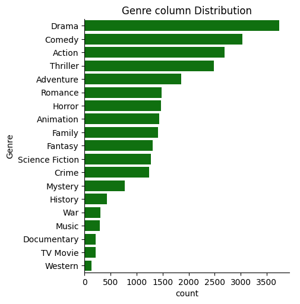
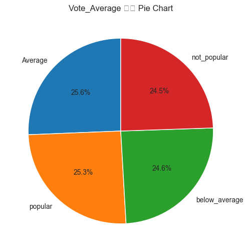
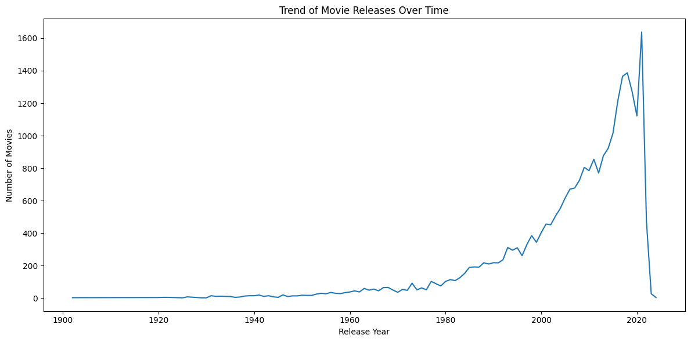

# Netflix Movie Data Analysis

This repository contains a Jupyter Notebook for analyzing Netflix movie data. The analysis involves data preprocessing, exploratory data analysis, and machine learning techniques to derive insights from the dataset.

## Table of Contents

1. [Introduction](#introduction)
2. [Libraries Used](#libraries-used)
3. [Features of the Notebook](#features-of-the-notebook)
4. [Usage](#usage)
5. [Results and Insights](#results-and-insights)
6. [Conclusion](#conclusion)

## Introduction

The goal of this project is to analyze Netflix movie data, preprocess it for machine learning models, and identify patterns or trends within the dataset. The steps include:
- Loading and cleaning the data
- Preprocessing and feature engineering
- Exploratory Data Analysis (EDA)

## Libraries Used

The following Python libraries are utilized in this project:

- `numpy`: For numerical operations
- `pandas`: For data manipulation and analysis
- `matplotlib`: For data visualization
- `seaborn`: For statistical data visualization
- `sklearn`: For machine learning tasks

## Features of the Notebook

1. **Data Loading**:
   - Importing the Netflix movie dataset into a pandas DataFrame.

2. **Preprocessing**:
   - Reformatting date columns.
   - Extracting unique items in genres.
   - Detecting and handling outliers.
   - General data preprocessing to clean and prepare the dataset.

3. **Exploratory Data Analysis**:
   - Visualizing trends and distributions.
   - Analyzing correlations between features.

4. **Machine Learning** (if applicable):
   - Training and evaluating models (e.g., clustering, regression, or classification).

## Usage

1. Clone the repository:
   ```bash
   git clone <repository-url>
   ```
2. Navigate to the directory:
   ```bash
   cd NetflixMovieDataAnalysis
   ```
3. Open the Jupyter Notebook:
   ```bash
   jupyter notebook NetFlixMovieDataAnalysis.ipynb
   ```
4. Run the cells sequentially to reproduce the analysis.

## Results and Insights

The notebook provides insights into Netflix movie data trends, such as:
- Genre popularity
- Release year trends
- Rating distributions
- Specific Year Trend In Movie In Genre
- Key factors influencing movie ratings

Further details are available in the notebook itself.


---

To include pictures in NetFilx Movie Data Analysis


Most Of The Vote Average Of Movie In Netflix


Specific Year Trend In Movie In Genre



## Conclusion

### Q1. What is the most frequent genre of movies Release Date?
**Answer**: Drama is the most frequent genre of movies released.

### Q2. What genre has the highest vote average?
**Answer**: Vote-Average has the highest genre average movie.

### Q3. What is the most frequent genre of movies Release Date in the year 2010?
**Answer**: The most frequent genre of movies released in 2010 is Drama.

### Q4. What movie got the highest popularity?
**Answer**: The movie with the highest popularity is Spider-Man: No Way Home.

### Q5. Which year has the most films of the year?
**Answer**: The year with the most films is 2020.


Feel free to contribute or raise issues for any improvements or clarifications!
